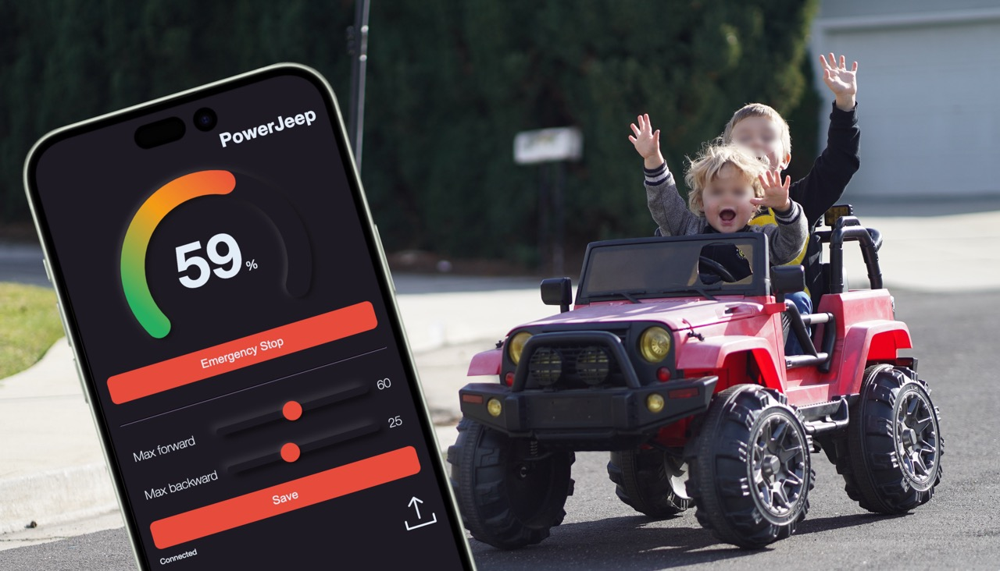

# PowerJeep. A Ryobi Battery Conversion for Ride on Cars

> Upgrade your electric ride on car with a 18v Ryobi battery and ESP32-powered electronics.

   

## Table of Contents

- [Introduction](#introduction)
- [Features](#features)
- [Requirements](#requirements)
- [Assembly](#assembly)
- [Usage](#usage)
- [Contributing](#contributing)
- [License](#license)

## Introduction

Welcome to the Ryobi Battery Conversion project for ride on cars!

This project aims to replace the old lead battery in your electric ride on car with a modern 18v Ryobi battery, providing improved performance!

By utilizing an ESP32 microcontroller, we enable enhanced control and monitoring capabilities for a safe and more enjoyable driving experience for every rider.

## Features

- **Ryobi Battery Integration:** Upgrade your kid car's power source to a Ryobi battery for extended runtime and enhanced performance.
- **ESP32 Control:** Utilize the ESP32 microcontroller for precise control, monitoring, and remote safety features.
- **Real-time Data Display:** Monitor the speed, configure and update the car through a sleek web-based dashboard.
- **Battery Protection:** Use safeguards to prevent over use and deep discharging.
- **Easy Customization:** Adapt the project to fit your specific kid car model and requirements.

⚠️ This project can send up to 18V to your motor, when they are usually taking 12V! It ramps up power to avoids gearbox damage, but be aware it can potentially fry your motor. Make sure it has the proper airflow to keep it cool

## Requirements

To replicate this project, you'll need the following things:

- Ride on car with a functionnal motor
- 18v Ryobi battery and charger
- 3D printer
- Basic hand tools (screwdriver, wire cutter/stripper, soldering iron)

### Electronic components

- 1x ESP32 [On Amazon](https://www.amazon.com/ESP-WROOM-32-Development-Microcontroller-Integrated-Compatible/dp/B08D5ZD528)
- 1x or 2x LM2596 - Voltage Regulator [On Amazon](https://www.amazon.com/gp/product/B08BLBYWN1)
- 1x XH-M609 - DC 12V-36V Voltage Protection Module [On Amazon](https://www.amazon.com/gp/product/B08X3HZ69D)
- 1x BTS7960 43A High Power Motor Driver Module [On Amazon](https://www.amazon.com/gp/product/B07TFB22H5)
- 1x 30A Circuit Breaker [On Amazon](https://www.amazon.com/gp/product/B096ZTV3CR)
- Wires and connectors

Optional
- 1x Throttle Pedal (permits precise throttle control, not just on/off) [On Amazon](https://www.amazon.com/KIMISS-Motorcycle-Accelerator-Throttle-Universal/dp/B07HMXLZ1H)

## Assembly

### Hardware

- Print the battery mount (I used this [one](https://www.thingiverse.com/thing:4587319))
- Print the component support [Source available on OnShare](https://cad.onshape.com/documents/73e5cd159b60a9bf46e87dae/w/8d4b4ae9f68daee1281f112d/e/6d32cd17a65725a466bf965e?renderMode=0&uiState=64801221829a90766f018f83)
- Replace the throttle pedal (optional)

### Software

#### First installation

1. Begin by cloning this repository to your local machine.
2. Open the project in VS Code with PlatformIO installed
2.1 If you replaced the pedal with a hall sensor one, enable WITH_ADC_THROTTLE in `power_wheel.c`. Mine is outputing 1v to 2.6v with 3.3v input, make sure yours is similar or update `get_throttle_position` accordingly.
3. Connect your ESP32 to your computer
4. Build & Upload the project
5. Upload Filesystem

### Update

1. Open the project in VS Code with PlatformIO installed
2. Build
3. Turn on the ride on car & Connect to the wifi
4. Drag and drop firmware.bin from `.pio` folder (or any static resources) onto the upload icon of the webpage

## Usage
- Turn on the fuse and drive!
- Don't forget to turn the fuse off when you are done.
- To go further
  - Connect your computer or mobile device to the Wi-Fi network emitted by the car.
  - It should open the page automatically as a captive portal. If it doesn't, open a web browser and enter the IP address http://192.168.4.1 to access the dashboard.
  - Use the interface to configure the car and view real-time speed. Emergency stop turns off the motor immediately.

## Contributing
Contributions are welcome! 

If you have any ideas, improvements, or bug fixes, please submit a pull request. For major changes, please open an issue first to discuss potential updates.

## License
This project is licensed under the MIT License.
